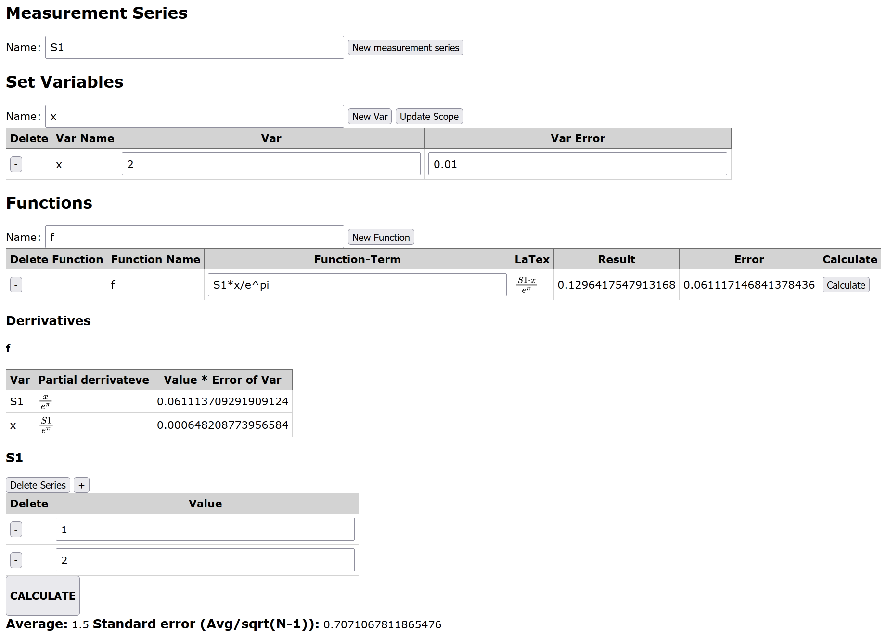

# LabBud
A Offline Website to take measurements and calculate errors, download and double-click index.html and you are good to go!

Uses Math.js and MathJax, included in this repo for convenience

Define measurement series, calculate their avg and standard errors automatically
Define know values and their errors (Hit update scope after you changed something)

Use them in functions you define, and get the result and error calculated
Even get the partial derivations that were used!

Save your results with Ctrl-S to save this site with all your data saved into it, for you to keep on working with later
